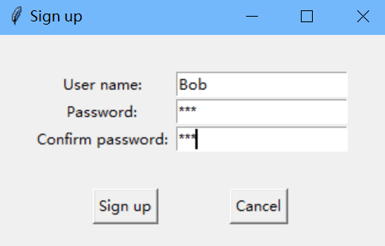
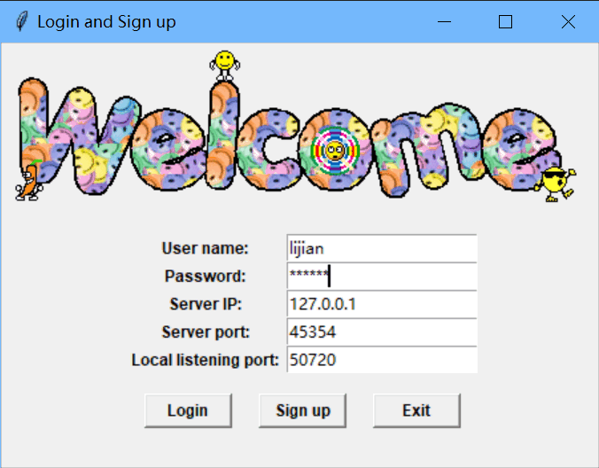
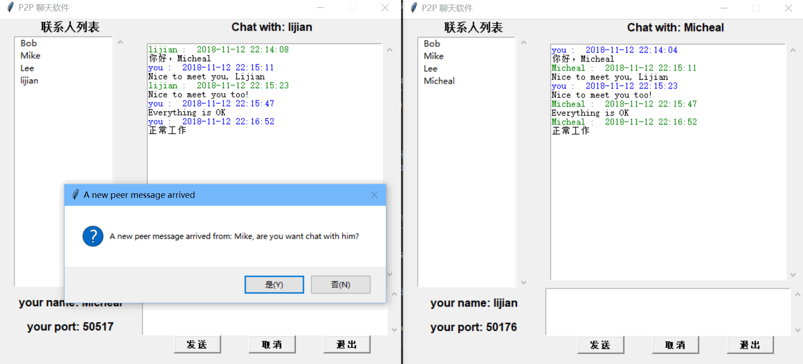
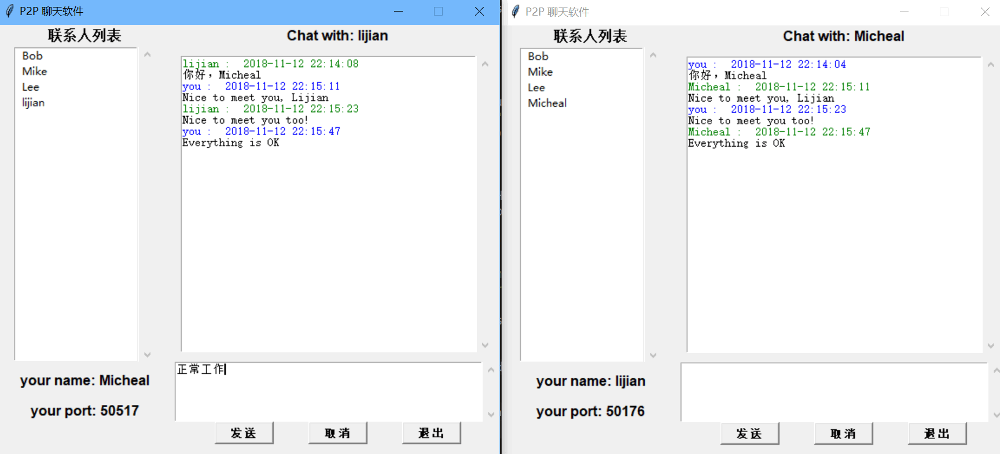

# P2P聊天软件

----

## 功能要求
* 用户界面（GUI）可自行设计，主要为用户提供方便。
* 用户界面要及时的对用户的操作做出反应。
* 要实现一个用户可以和多个用户同时进行聊天。

## 设计目标及流程
设计一个P2P聊天软件，由多个聊天客户端和一个中心服务器组成。各个聊天客户端可以两两相互发送消息。目的在于设计GUI、多线程和套接字编程。各个客户端用IP地址和TCP/IP监听端口号进行标识。每个客户提供一个名字，方便其它客户端。

此设计由两部分组成。

### 第一部分：注册
P2P聊天中各个成员管理。每个成员称为一个peer，要有一个中心的服务处理peer的登记和对已经登记的peer进行更新。
* 步骤1：一个peer选择一个名字，通过登记界面进行登记。
* 步骤2：服务器拥有一个公有IP，在一个众所周知的端口进行监听。Peer向服务器发送‘register’请求，同时发送自己的登记信息（如己取的名字，自己的监听端口号等）。服务器收到‘register’请求后，如果这是每一个登记请求，服务器建立一个用于记录已经登记peer的列表（Peer List），否则更新Peer List。
* 步骤3：服务器向来登记的peer发送Peer List。PeerList 由一些活跃的peer组成，一个活跃的peer是在最近30秒内进行登记的peer。
* 步骤4：peer收到 Peer List后，以适当的形式显示出来。设计一个显示Peer List的GUI。
* 步骤5：每个已经登记的peer每隔15秒向服务器登记，来使自己保持活跃，同时得到最近新登记的peer信息。如果需要，就在自己的PeerList GUI进行更新。

### 第二部分：交互
多个peer间相互发送消息。
* 步骤1：在的客户端P1的用户U1（U1@P1）在自己Peer List GUI中选择一个peer，假设为U2@P2。
* 步骤2：P1建立一个到P2的连接。
* 步骤3：U1在自己的发送信息界面（Messaging GUI）编写信息，然后点击发送按钮，P1将信息通过步骤2中建立的连接发送到P2。
* 步骤4：如果第3个用户U3@P3发送一条消息到U1@P1，如果U1此时正好有一个Messaging GUI与U3进行交互，那么就显示消息，如果没有，就要提示U1有新消息到来。两个User之间可以相互发送消息，每对User之间有一个单独的Messaging GUI。

## 软件组成
技术栈
* Tkinter     界面
* ThreadingTCPServer
* threading

本软件由 Client 和 Server 两部分组成，其中 Client 为客户端，可执行注册和聊天过程，而 Server 为注册服务器，主要用于注册客户端和分发注册客户端信息。

## 软件运行界面
* 客户端注册登录界面

* 客户端界面

* 客户端通信聊天界面

## 还未解决的 BUG
* 正常登录后，客户端会出现一两分钟的卡顿，期间不能响应键盘消息
* 同时与多人聊天，一个用户开第二个界面时，第二个界面有部分信息不能正常显示
